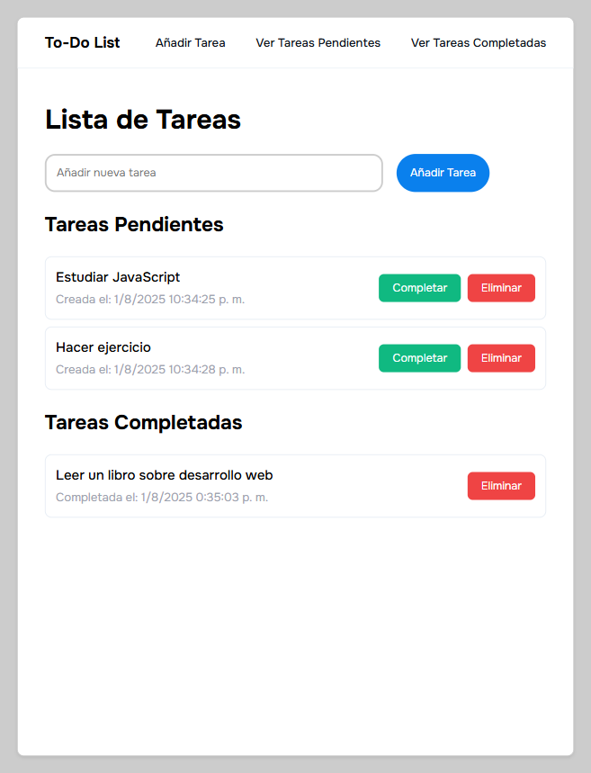

# ✅ To-Do List con JavaScript

Una aplicación de lista de tareas interactiva desarrollada con HTML, CSS y JavaScript vanilla. Este es el **Proyecto #2** de mi serie de proyectos de desarrollo web.

## 📋 Descripción

Aplicación web para gestionar tareas diarias con una interfaz moderna y funcional. Permite añadir, marcar como completadas y eliminar tareas, con persistencia de datos usando localStorage y timestamps para seguimiento temporal.

## ✨ Características Implementadas

- **Añadir tareas:** Interfaz intuitiva con formulario y validación
- **Marcar como completadas:** Sistema que mueve tareas entre secciones
- **Eliminar tareas:** Botón de eliminación desde cualquier estado
- **Persistencia de datos:** Almacenamiento local con localStorage
- **Separación visual:** Secciones distintas para pendientes y completadas
- **Timestamps:** Fecha y hora de creación y completado
- **Navegación interna:** Enlaces de anclaje para acceso rápido
- **Efectos visuales modernos:** Transiciones CSS y efectos hover
- **Interfaz intuitiva:** UX optimizada para productividad
- **Validación de entrada:** Prevención de tareas vacías

## 🛠️ Tecnologías Utilizadas

- **HTML5:** Estructura semántica moderna con:
  - Formularios accesibles
  - Navegación con enlaces de anclaje
  - Meta tags optimizados
- **CSS3:** Estilos avanzados con:
  - Flexbox para layouts responsivos
  - Transiciones y transformaciones
  - Scrollbar personalizado
  - Efectos hover interactivos
  - Diseño tipo tarjeta moderno
- **JavaScript ES6+:** Lógica de la aplicación con:
  - Manipulación del DOM
  - Event listeners
  - localStorage API
  - Manejo de fechas (Date objects)
  - Funciones modulares
- **Google Fonts:** Tipografía Onest (100-900 weights)

## 🎨 Diseño y Estilo

### Paleta de Colores

```css
/* Tema limpio y moderno */
--bg-primary: #ccc; /* Fondo de página */
--bg-secondary: #ffffff; /* Fondo del contenedor */
--text-primary: #0d151c; /* Texto principal */
--text-secondary: #9ca3af; /* Texto secundario */
--accent: #0a80ed; /* Color de acento azul */
--success: #10b981; /* Verde para completar */
--danger: #ef4444; /* Rojo para eliminar */
--border: #e7edf4; /* Bordes suaves */
```

### Efectos Especiales

- **Header sticky** con fondo fijo
- **Transiciones suaves** en botones (scale y translateY)
- **Efectos focus** en input con transformación
- **Scrollbar personalizado** en el contenido principal
- **Tarjetas elevadas** con bordes redondeados

## 📂 Estructura del Proyecto

```
02-to-do-list/
├── index.html              # Página principal
├── styles.css              # Estilos CSS
├── script.js               # Lógica JavaScript
├── screenshots/            # Capturas de pantalla
│   └── app-view.png        # Vista de la aplicación
└── README.md              # Documentación
```

## 🚀 Instalación y Uso

### Clonar el repositorio

```bash
git clone https://github.com/Zero-Fhx/02-to-do-list.git
cd 02-todo-list
```

### Ejecutar el proyecto

1. **Método simple:** Abre `index.html` directamente en tu navegador
2. **Con Live Server (recomendado):**
   - Instala Live Server en VS Code
   - Click derecho en `index.html` → "Open with Live Server"
3. **Servidor local:**

   ```bash
   # Con Python 3
   python -m http.server 8000

   # Con Node.js (http-server)
   npx http-server
   ```

## ✅ Requisitos Cumplidos

Este proyecto incluye todas las características esenciales de una To-Do List:

- [x] Añadir tareas con input de texto
- [x] Marcar tareas como completadas
- [x] Eliminar tareas individuales
- [x] Persistencia con localStorage
- [x] Interfaz moderna y funcional
- [x] Validación de entrada de datos
- [x] Efectos visuales y animaciones
- [x] Separación visual entre estados

## 🌐 Demo en Vivo

🔗 **[Ver Demo](https://zero-fhx.github.io/02-to-do-list/)** (GitHub Pages)

## 📸 Captura de Pantalla



## 🔧 Características Técnicas Destacadas

### Estructura de Datos de Tareas

```javascript
function createTask(title) {
  return {
    id: nextId++,
    title: title,
    completed: false,
    createdAt: new Date(),
    updatedAt: new Date(),
  };
}
```

### Gestión de Estado con localStorage

```javascript
function saveTasks() {
  localStorage.setItem("tasks", JSON.stringify(tasks));
}

function loadTasks() {
  const storedTasks = localStorage.getItem("tasks");
  if (storedTasks) {
    const parsed = JSON.parse(storedTasks);
    tasks = parsed.map((task) => ({
      ...task,
      createdAt: new Date(task.createdAt),
      updatedAt: new Date(task.updatedAt),
    }));
    nextId = tasks.length ? Math.max(...tasks.map((t) => t.id)) + 1 : 1;
    renderTasks();
  }
}
```

### Efectos CSS Interactivos

```css
#add-task-btn:hover {
  background-color: #0969c4;
  transform: translateY(-2px) scale(1.03);
  cursor: pointer;
}

#task-input:focus {
  border-color: #0a80ed;
  outline: none;
  transform: scale(1.03);
}
```

### Renderizado Dinámico

```javascript
function renderTasks() {
  const pendingList = document.getElementById("tasks");
  const completedList = document.getElementById("completed-tasks");

  // Separación automática entre pendientes y completadas
  tasks.forEach((task) => {
    // Creación dinámica de elementos DOM
    // Manejo de timestamps para mostrar fechas
    // Gestión de botones según estado
  });
}
```

## 🔮 Futuras Mejoras

- [ ] **Edición inline** de tareas existentes
- [ ] **Categorías y etiquetas** para organización
- [ ] **Fechas de vencimiento** con recordatorios
- [ ] **Arrastrar y soltar** para reordenar
- [ ] **Modo oscuro** toggle
- [ ] **Contador de tareas** en header
- [ ] **Búsqueda y filtros** avanzados
- [ ] **Animaciones de entrada/salida** para tareas
- [ ] **Confirmación de eliminación** con modal
- [ ] **Exportar/Importar** tareas en JSON

## 📝 Lecciones Aprendidas

### JavaScript Fundamental

- **Manipulación del DOM** para crear elementos dinámicamente
- **Event handling** con addEventListener y onclick
- **localStorage** para persistencia con serialización JSON
- **Manejo de fechas** con objetos Date
- **Gestión de estado** con arrays y objetos

### Patrones de Desarrollo

- **Separación de responsabilidades** entre funciones
- **Funciones puras** para creación de tareas
- **Renderizado reactivo** al cambiar el estado
- **Validación de entrada** para prevenir errores

### CSS y UX Design

- **Flexbox layouts** para diseño responsive
- **Transiciones CSS** para feedback visual
- **Sticky positioning** para header fijo
- **Custom scrollbars** para mejor UX
- **Hover states** para interactividad

### Persistencia de Datos

- **Serialización JSON** de objetos complejos
- **Deserialización** con reconstrucción de fechas
- **Gestión de IDs únicos** para elementos
- **Recuperación de estado** al cargar la aplicación

## 🤝 Contribuciones

Este es un proyecto personal de aprendizaje, pero si encuentras mejoras o tienes sugerencias:

1. Fork el repositorio
2. Crea una rama para tu feature (`git checkout -b feature/mejora`)
3. Commit tus cambios (`git commit -m 'Añadir mejora'`)
4. Push a la rama (`git push origin feature/mejora`)
5. Abre un Pull Request

## 👨‍💻 Autor

**Erick Obed Flores Ricra**

- 🐙 GitHub: [@Zero-Fhx](https://github.com/Zero-Fhx)
- 💼 LinkedIn: [Erick Obed Flores Ricra](https://www.linkedin.com/in/erick-obed-flores-ricra-14a121280)
- 📧 Email: erickflores170404@gmail.com

---

**🤖 Desarrollo Asistido por IA:** Este proyecto fue desarrollado con la asistencia de inteligencia artificial para la búsqueda de información, resolución de problemas técnicos, optimización de código, consulta de conceptos desconocidos y creación de esta documentación.
